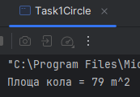
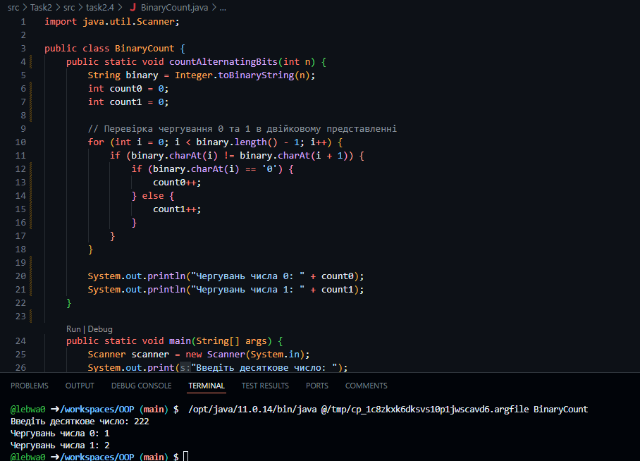

# Практика ООП

## Завдання 1 (29.03.24)

- Створити репозиторій
- Написати просту консольну програму

## Завдання 2 - Класи та об'єкти  (01.04.24)
- Розробити клас, що серіалізується, для зберігання параметрів і результатів
обчислень.
Використовуючи агрегування, розробити клас для знаходження рішення
задачі. 
-  Розробити клас для демонстрації в діалоговому режимі збереження та
відновлення стану об'єкта, використовуючи серіалізацію. Показати особливості
використання transient полів. 
-  Розробити клас для тестування коректності результатів обчислень та
серіалізації/десеріалізації.
Використовувати докладні коментарі для автоматичної генерації
документації засобами javadoc.

- Виконати індивідуальне завдання згідно (9) номеру  в списку.
Індивідуальне завдання -  Підрахувати кількість чергувань 0 та 1 у двійковому поданні заданого
десяткового числа.

