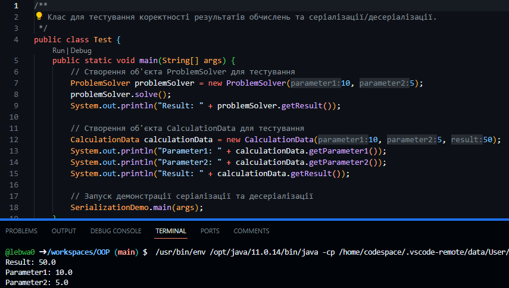

# Практика ООП

## Завдання 1 (29.03.24)

- Створити репозиторій
- Написати просту консольну програму

## Завдання 2 - Класи та об'єкти  (01.04.24)
- Розробити клас, що серіалізується, для зберігання параметрів і результатів
обчислень.
Використовуючи агрегування, розробити клас для знаходження рішення
задачі. 
-  Розробити клас для демонстрації в діалоговому режимі збереження та
відновлення стану об'єкта, використовуючи серіалізацію. Показати особливості
використання transient полів. 
-  Розробити клас для тестування коректності результатів обчислень та
серіалізації/десеріалізації.
Використовувати докладні коментарі для автоматичної генерації
документації засобами javadoc.

- Виконати індивідуальне завдання згідно (9) номеру  в списку.
Індивідуальне завдання -  Підрахувати кількість чергувань 0 та 1 у двійковому поданні заданого
десяткового числа.

## Завдання 3 - Спадкування (02.04.24)

Як основа використовувати вихідний текст проекту попередньої лабораторної роботи. 
- Забезпечити розміщення результатів обчислень уколекції з можливістю збереження/відновлення.
- Використовуючи шаблон проектування Factory Method (Virtual Constructor), розробити ієрархію, що передбачає розширення рахунок додавання
нових відображуваних класів.
- Розширити ієрархію інтерфейсом "фабрикованих" об'єктів, що представляє набір методів для відображення результатів обчислень.
- Реалізувати ці методи виведення результатів у текстовому виде.
- Розробити тареалізувати інтерфейс для "фабрикуючого" методу.

Тестування програмного коду 

## Завдання 4 - Поліморфізм (03.04.24)

- За основу використовувати вихідний текст проекту попередньої лабораторної роботи Використовуючи шаблон проектування Factory Method
(Virtual Constructor), розширити ієрархію похідними класами, реалізують методи для подання результатів у вигляді текстової
таблиці. Параметри відображення таблиці мають визначатися користувачем.
- Продемонструвати заміщення (перевизначення, overriding), поєднання (перевантаження, overloading), динамічне призначення методів
(Пізнє зв'язування, поліморфізм, dynamic method dispatch).
- Забезпечити діалоговий інтерфейс із користувачем.
- Розробити клас для тестування основної функціональності.
- Використати коментарі для автоматичної генерації документації засобами javadoc.